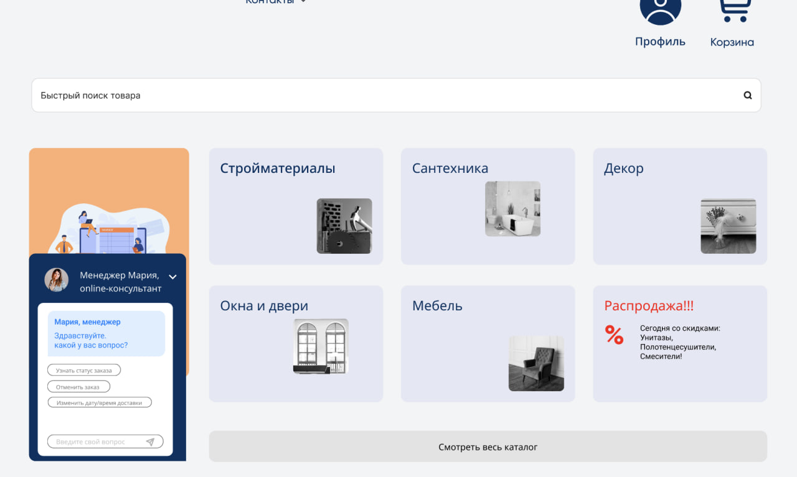
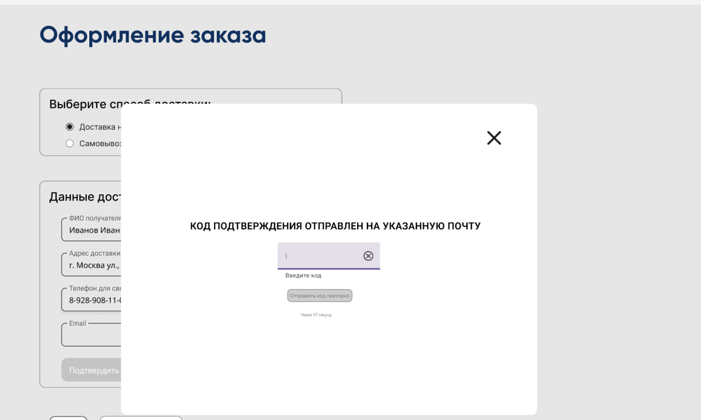
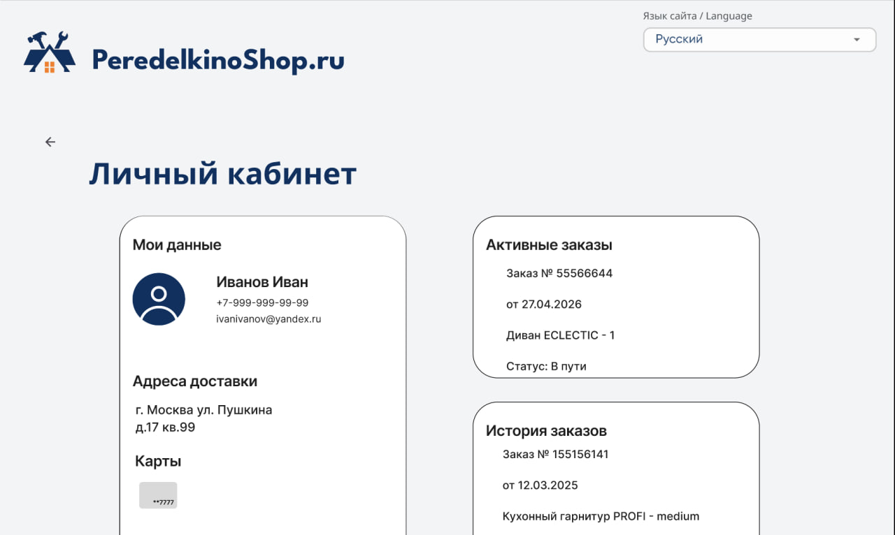

# Оптимизация сайта магазина «Переделкино»

## Контекст

Сайт магазина строительных материалов и товаров для дома «Переделкино» содержал критические проблемы в пользовательских сценариях и бизнес-логике: ошибки валидации форм, неудобную навигацию, некорректную обработку заказов и перегружающий интерфейс онлайн-консультанта. Это приводило к росту невалидных заказов, дополнительной нагрузке на сотрудников и снижению доли оплаченных онлайн-заказов.

## Цель проекта

Провести комплексный анализ текущего состояния сайта, выявить причины операционных и UX-проблем, а также спроектировать решение, повышающее удобство оформления заказа и эффективность ключевых бизнес-процессов, связанных с онлайн-продажами.

## Артефакты

* Отчет об обследовании
* Customer Journey Map (CJM)
* BPMN-модель процессов AS-IS / TO-BE
* UML-диаграммы классов и объектов
* Требования к решению с Use Case
* Пользовательская инструкция
* [Интерактивный прототип сайта](https://www.figma.com/proto/Lduwl3K2NjHmyTon2hqW9g/%D0%9F%D0%B5%D1%80%D0%B5%D0%B4%D0%B5%D0%BB%D0%BA%D0%B8%D0%BD%D0%BE?node-id=4-14168&starting-point-node-id=4%3A14168&t=1fnl5DZHJSJCwwTN-1)

## Результат

Спроектировано комплексное решение по оптимизации сайта и процесса оформления заказа. Реализованы валидация пользовательских данных, автоматическая проверка бизнес-правил доставки, улучшены сценарии применения промокодов и личного кабинета, а также переработана работа онлайн-консультанта через сценарный чат-бот. Решение позволило устранить ключевые точки отказа в клиентском пути и повысить надежность процесса оформления и оплаты заказов онлайн.

