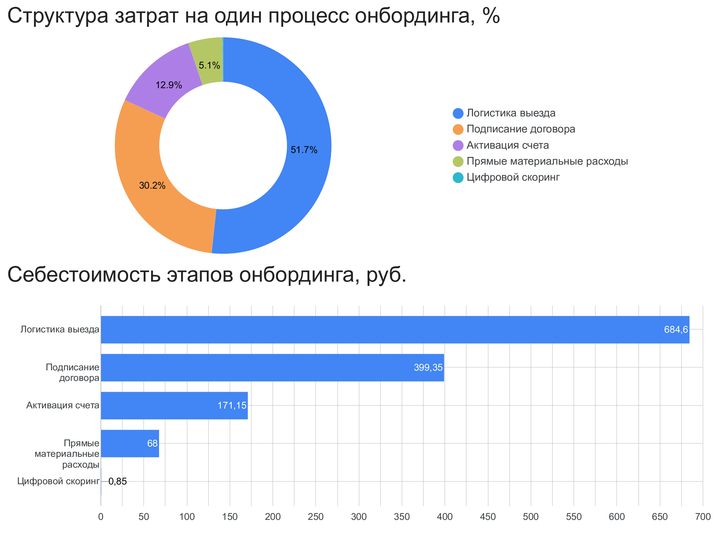

# Трансформация цифрового онбординга клиентов в Т-Банке

## Контекст

На фоне активного роста клиентской базы и интеграции Т-Банка c Росбанком существенно выросла нагрузка на процесс выездной идентификации клиентов, что усилило давление на операционные расходы и рентабельность капитала.

## Цель проекта

Проанализировать текущий процесс цифрового онбординга клиентов в Т-Банке, выявить ключевые источники операционных затрат и спроектировать целевой процесс с использованием ЕБС, направленный на снижение издержек и ускорение активации банковских продуктов.

## Артефакты

* [Customer Journey Map (CJM)]([https://miro.com/app/board/uXjVH90zxe4=/?share_link_id=513893418024](https://miro.com/app/live-embed/uXjVH90zxe4=/?focusWidget=3458764677672643132&embedMode=view_only_without_ui&embedId=688416866585))
* [BPMN-модель AS-IS](./bpmn-as-is.png)
* [BPMN-модель TO-BE](./bpmn-to-be.png)
* [Дашборд стоимости процесса онбординга](https://datastudio.google.com/reporting/fb3c7a52-e3d1-45b3-bc0c-abc1927bbea8)

## Результат

Спроектирован целевой процесс цифрового онбординга с интеграцией ЕБС, позволяющий сократить зависимость от выездной идентификации клиентов. В результате стоимость онбординга снизилась с **1 324 ₽ до 244 ₽** на клиента (**−81%**), а время активации банковского продукта сократилось с **115 до 10 минут**. Решение демонстрирует потенциал значительного снижения операционных расходов и повышения масштабируемости клиентского онбординга.

---
### Дашборд себестоимости цифрового онбординга клиентов

